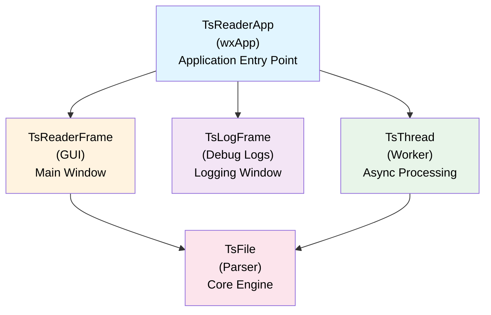
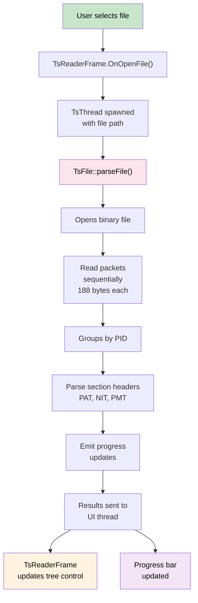
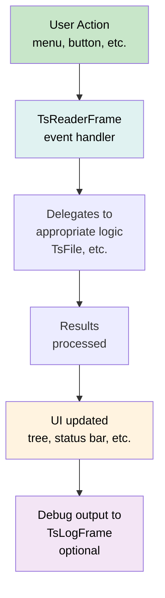

# TsReader Architecture

## High-Level Architecture



## Component Layers

### 1. **Presentation Layer (UI)**
- **TsReaderFrame**: Main window containing the GUI
  - Tree control for displaying packet hierarchy
  - Menu bar with file operations and help
  - Status bar showing current operations
  - Progress bar for parsing feedback
  - Interaction with user for file selection

- **TsLogFrame**: Separate window for debug output
  - Displays log messages with timestamps
  - Thread-aware logging
  - Configurable debug levels

### 2. **Application Layer**
- **TsReaderApp**: wxWidgets application class
  - Application initialization
  - Event handling
  - Window management

### 3. **Business Logic Layer**
- **TsFile**: Core parsing engine
  - Reads binary TS file
  - Extracts 188-byte packets
  - Groups packets by PID
  - Parses section data (PAT, NIT, PMT)
  - Manages packet metadata

- **TsMsg**: Data structures
  - Packet definitions
  - Section structures
  - Message containers

### 4. **Supporting Utilities**
- **TsThread**: Multi-threading support
  - Extends wxThread
  - Enables asynchronous parsing
  - Keeps UI responsive

- **TsDbg**: Debug and logging utilities
  - Conditional debug macros
  - Debug level management
  - Formatted logging output

## Data Flow

### File Parsing Flow


### Event Flow


## Standards Support

### Currently Implemented
- **MPEG-2** (ISO/IEC 13818-1): Core Transport Stream structure
  - 188-byte packet structure with sync byte (0x47)
  - PID extraction and packet grouping
  - **Program Association Table (PAT)** parsing (fully implemented)
  - Conditional Access Table (CAT) - PID recognized but not parsed

### Infrastructure Present (Incomplete/Stubs Only)
- **DVB** (ETSI EN 300 468):
  - **Network Information Table (NIT)** - PID 0x10 recognized, parser stub exists
  - **Program Map Table (PMT)** - Parser stub exists but not implemented
  - Other DVB tables (SDT, BAT, EIT, TDT) - PIDs recognized in lookup table only

### Not Implemented
- **ATSC** (USA digital television)
- **SCTE** (Splice Cue, Digital Program Insertion)
- **ISDB** (Japanese television standard)
- **ARIB** (Japanese broadcast standard)

### Implementation Scope
TsReader is primarily a **MPEG-2 Transport Stream packet viewer and analyzer** with complete PAT parsing support. It provides infrastructure for extending support to other tables but focus is on packet-level analysis rather than semantic interpretation of all TS table types.

## Key Design Patterns

### 1. **Model-View Separation**
- **Model**: TsFile (parsing logic, data extraction)
- **View**: TsReaderFrame (UI components, visualization)
- Decoupled through event notifications

### 2. **Thread Isolation**
- Parsing happens in worker thread (TsThread)
- GUI updates queued to main thread
- Prevents UI freezing during long operations

### 3. **Singleton Pattern** (implied)
- TsReaderApp manages single application instance
- TsLogFrame is typically single instance
- Main window (TsReaderFrame) is primary interface

### 4. **Observer Pattern**
- TsReaderFrame observes file parsing progress
- Progress updates trigger UI refresh
- Debug messages trigger log window updates

## Packet Structure

Transport Stream packets follow MPEG-2 standard:

```
Offset  Field Name              Size        Description
────────────────────────────────────────────────────────
0       Sync Byte               1 byte      Always 0x47
1       Header Fields           2 bytes     Contains PID and flags
3       Payload                 184 bytes   Actual data
```

Each packet is exactly **188 bytes**.

### PID (Packet ID) Mapping

- **PID 0**: Program Association Table (PAT)
- **PID 1**: Conditional Access Table (CAT)
- **PID 16-8190**: User-defined (usually PMT, video, audio, etc.)
- **PID 8191**: Null packets (filler)

## Threading Model

### Main Thread
- Runs GUI/wxWidgets event loop
- Handles user interactions
- Updates UI elements

### Worker Thread (TsThread)
- Performs file I/O
- Executes parsing logic (TsFile)
- Sends results back to main thread via events

This architecture prevents:
- UI freezing during long file operations
- Responsiveness issues
- Application becoming unresponsive to user input

## Debug System

The debug system uses conditional macros in TsDbg.hpp:

```cpp
DBG_SERIES(msg)     // Series debug info
DBG_READ(msg)       // Read operations
DBG_ERROR(msg)      // Error conditions
DBG_WARN(msg)       // Warning conditions
```

Debug output is collected and displayed in TsLogFrame with:
- Timestamp
- Thread ID
- Debug level
- Message content

## Dependencies

### External
- **wxWidgets**: GUI framework (required)
- **Standard C++ Library**: C++17 features

### Internal
- All components integrated within single executable
- No external dependencies on other libraries

## Extension Points

### Adding New Section Parsers
1. Extend `TsFile::parseSection()`
2. Add new parser method for section type
3. Update tree building logic in TsReaderFrame

### Adding New UI Elements
1. Create new frame class inheriting wxFrame
2. Integrate with TsReaderFrame
3. Add event handlers and update logic

### Adding New Logging Features
1. Extend TsDbg debug macros
2. Update TsLogFrame display logic
3. Add new debug level if needed
