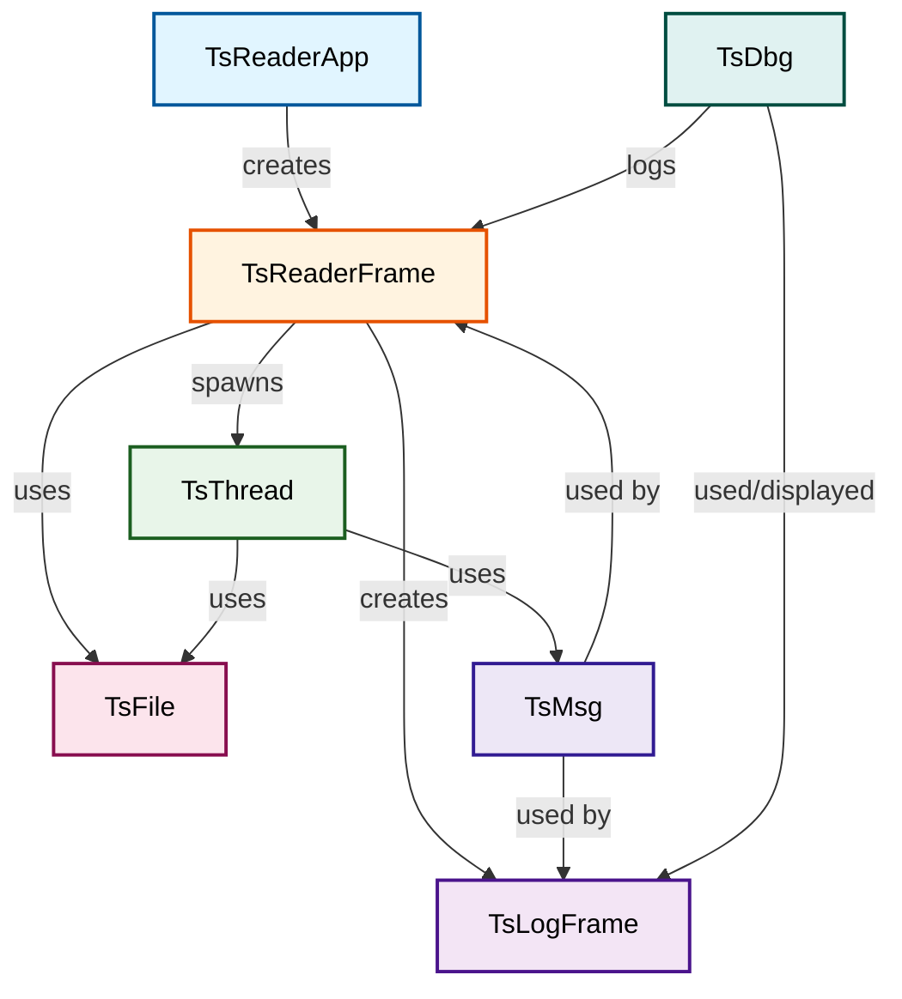

# TsReader Components Documentation

## Component Overview

Each component serves a specific purpose in the TsReader application. Below is detailed documentation for each major component.

---

## 1. TsReaderApp (Application Entry Point)

**File**: [include/TsReaderApp.hpp](../include/TsReaderApp.hpp), [src/TsReaderApp.cpp](../src/TsReaderApp.cpp)

### Purpose
Main application class following wxWidgets framework convention. Acts as the entry point for the entire application.

### Responsibilities
- Application initialization
- Main window creation and management
- Event loop management
- Application-level configuration

### Key Features
- Inherits from `wxApp`
- Implements `OnInit()` to set up the application
- Manages lifetime of main frame

### Usage
```cpp
wxIMPLEMENT_APP(TsReaderApp);  // wxWidgets macro to declare app entry point
```

### Related Components
- Owns and manages `TsReaderFrame`
- Coordinates `TsLogFrame` creation if needed

---

## 2. TsReaderFrame (Main Window)

**File**: [include/TsReaderFrame.hpp](../include/TsReaderFrame.hpp), [src/TsReaderFrame.cpp](../src/TsReaderFrame.cpp)

### Purpose
Main application window providing the graphical user interface for file browsing and data visualization.

### Responsibilities
- Display hierarchical tree view of TS packets
- Manage menu bar and toolbar
- Handle file open operations
- Trigger file parsing operations
- Update progress indicators
- Display parsing results

### Key Features

#### UI Components
- **Tree Control**: Displays packet hierarchy grouped by PID
- **Menu Bar**: 
  - File menu (Open, Exit)
  - Help menu (About)
  - View menu (Logger window)
- **Status Bar**: Shows current operation status
- **Progress Bar**: Visual feedback during parsing

#### Data Display
- PID-based organization of packets
- Hierarchical display of sections (PAT, NIT, PMT)
- Packet details and metadata

#### Event Handlers
- `OnOpen()`: File selection dialog
- `OnParse()`: Triggers parsing operation
- `OnShowLog()`: Opens/shows debug log window
- Progress update handlers

### Internal Structure
```cpp
class TsReaderFrame : public wxFrame {
private:
    wxTreeCtrl* m_tree;           // Packet tree visualization
    wxStatusBar* m_status;        // Status display
    wxGauge* m_progress;          // Progress indicator
    TsFile* m_tsFile;             // Parser instance
    map<int, string> m_pidNames;  // PID to name mapping
};
```

### Related Components
- Uses `TsFile` for parsing
- Creates/manages `TsLogFrame`
- Spawns `TsThread` for async parsing

---

## 3. TsFile (Core Parser)

**File**: [include/TsFile.hpp](../include/TsFile.hpp), [src/TsFile.cpp](../src/TsFile.cpp)

### Purpose
Core parsing engine responsible for reading and analyzing Transport Stream files. Implements MPEG-2 (ISO/IEC 13818-1) Transport Stream packet parsing. Handles all binary file I/O and packet extraction logic.

**Standards Supported**:
- **MPEG-2** (ISO/IEC 13818-1): Full Transport Stream packet structure parsing
- **Program Association Table (PAT)**: Fully implemented
- Infrastructure for DVB tables (NIT, PMT) - parser stubs present

### Responsibilities
- Open and read binary TS files
- Extract individual 188-byte packets (per MPEG-2 standard)
- Group packets by PID (Packet ID)
- Parse Program Association Table (PAT) - fully implemented
- Parse packet headers and flags
- Generate parsing results and statistics

### Key Structures

#### ts_packet_t
Represents a single TS packet:
```cpp
struct ts_packet_t {
    uint8_t sync_byte;           // Always 0x47
    uint16_t pid;                // Packet ID (13 bits)
    uint8_t payload[184];        // Packet payload
    // Additional metadata fields
};
```

#### ts_pid_t
Tracks PID information and collected packets:
```cpp
struct ts_pid_t {
    int pid;                     // PID number
    string description;          // PID description (PAT, PMT, etc.)
    vector<ts_packet_t> packets; // All packets with this PID
    int packet_count;            // Count of packets
};
```

### Key Methods

#### `parseFile(const string& filepath)`
- Main parsing entry point
- Reads entire file sequentially
- Extracts packets and groups by PID
- Returns parsing statistics

#### `extractPacket(const uint8_t* buffer)`
- Reads single 188-byte packet from buffer (per MPEG-2 ISO/IEC 13818-1 standard)
- Validates sync byte (0x47 = start of packet)
- Extracts PID (13-bit packet identifier, range 0-8191)
- Extracts transport packet flags (TEI, PUSI, TSC, AFC, CC)
- Parses adaptation field if present (according to adaptation_field_control)
- Returns ts_packet_t structure with all header fields

#### `groupByPID()`
- Organizes parsed packets by PID
- Creates PID summary information

#### `parsePAT()`
- Program Association Table parsing (fully implemented)
- Extracts program information and PMT locations

#### `parseNIT()`, `parsePMT()`
- Parser stubs present (not fully implemented)

### Parsing Pipeline
```
Input: Binary TS file
    ↓
Open file
    ↓
Read 188-byte chunks
    ↓
Validate sync byte (0x47)
    ↓
Extract header fields (PID, flags)
    ↓
Group packets by PID
    ↓
Parse section headers
    ↓
Generate statistics
    ↓
Output: Parsed data structure
```

### Error Handling
- File not found detection
- Sync byte validation
- Incomplete packet handling
- Section parsing error recovery

### Related Components
- Used by `TsReaderFrame` for parsing
- Run in `TsThread` for async operation
- Reports progress through callbacks
- Logs output via `TsDbg`

---

## 4. TsLogFrame (Debug Logging Window)

**File**: [include/TsLogFrame.hpp](../include/TsLogFrame.hpp), [src/TsLogFrame.cpp](../src/TsLogFrame.cpp)

### Purpose
Dedicated window for displaying debug and logging information. Provides visibility into internal operations and aids in troubleshooting.

### Responsibilities
- Display debug messages
- Filter messages by debug level
- Show message timestamps
- Display thread information
- Persist log history during session

### Key Features

#### Message Display
- Timestamp for each message
- Thread ID information
- Debug level indicator
- Formatted message text

#### Debug Levels
Supports various debug levels:
- **ERROR**: Critical errors
- **WARN**: Warning conditions
- **INFO**: Informational messages
- **DEBUG**: Detailed debug information
- **TRACE**: Very detailed trace information

#### Controls
- Clear button to reset log display
- Filter controls by debug level
- Pause/resume logging
- Export/save log option

### Internal Structure
```cpp
class TsLogFrame : public wxFrame {
private:
    wxTextCtrl* m_logText;      // Multi-line text display
    wxListCtrl* m_logList;      // Structured log view
    vector<string> m_logBuffer; // Message history
    int m_maxLogSize;           // Maximum stored messages
};
```

### Log Message Format
```
[HH:MM:SS.mmm] [ThreadID] [LEVEL] Message text here
```

### Related Components
- Receives messages from `TsDbg` logging system
- Can be launched from `TsReaderFrame`
- Displays output from any component

---

## 5. TsThread (Worker Thread)

**File**: [include/TsThread.hpp](../include/TsThread.hpp), [src/TsThread.cpp](../src/TsThread.cpp)

### Purpose
Provides asynchronous execution capability for long-running operations. Enables responsive UI while file parsing occurs in background.

### Responsibilities
- Execute parsing operations asynchronously
- Manage thread lifecycle
- Report progress to main thread
- Handle thread synchronization

### Key Features

#### Thread Management
- Inherits from `wxThread`
- Implements `Entry()` method for thread work
- Safe thread termination handling
- Event-based communication with main thread

#### Progress Reporting
- Regular progress updates to UI thread
- Completion notifications
- Error reporting mechanism

### Thread Lifecycle
```
Create TsThread instance
    ↓
Call Create()
    ↓
Call Run()
    ↓
Execute Entry() in worker thread
    ↓
Send progress/completion events
    ↓
Thread exits
    ↓
OnExit() cleanup
```

### Synchronization
- Uses wxThread-provided synchronization
- Mutex protection for shared data
- Event-based inter-thread communication

### Usage Pattern
```cpp
TsThread* thread = new TsThread(filepath);
thread->Create();
thread->Run();
// Later, receive completion event in main thread
```

### Related Components
- Spawned by `TsReaderFrame`
- Executes `TsFile::parseFile()`
- Reports results back to `TsReaderFrame`

---

## 6. TsMsg (Message and Packet Structures)

**File**: [include/TsMsg.hpp](../include/TsMsg.hpp), [src/TsMsg.cpp](../src/TsMsg.cpp)

### Purpose
Defines data structures and messages used throughout the application. Provides a central location for data type definitions.

### Key Structures

#### Packet Structures
- `ts_packet_t`: Individual TS packet (188 bytes)
- `ts_header_t`: Packet header information
- `ts_adaptation_field_t`: Adaptation field data

#### Section Structures
- `pat_section_t`: Program Association Table
- `nit_section_t`: Network Information Table
- `pmt_section_t`: Program Map Table

#### Result Structures
- `parse_result_t`: Overall parsing results
- `pid_info_t`: PID statistics and metadata
- `section_info_t`: Section-specific information

### Data Definitions

#### PID Categories
Constants defining well-known PIDs:
```cpp
const int PID_PAT = 0;        // Program Association Table
const int PID_CAT = 1;        // Conditional Access Table
const int PID_NIT = 16;       // Network Information Table
const int PID_NULL = 8191;    // Null packets
```

### Related Components
- Used by all components for data exchange
- Central to `TsFile` parsing structures
- Displayed by `TsReaderFrame` in UI

---

## 7. TsDbg (Debug and Logging System)

**File**: [include/TsDbg.hpp](../include/TsDbg.hpp), [src/TsDbg.cpp](../src/TsDbg.cpp)

### Purpose
Provides centralized debug logging capability with conditional compilation and filtering. Enables diagnostic output without impacting release performance.

### Responsibilities
- Conditional debug output
- Thread-aware logging
- Debug level management
- Message formatting

### Debug Macros

#### Available Macros
```cpp
DBG_SERIES(msg)    // Series-level debug
DBG_READ(msg)      // Read operation debug
DBG_ERROR(msg)     // Error message
DBG_WARN(msg)      // Warning message
DBG_INFO(msg)      // Information message
```

#### Compilation Control
Debug macros are conditionally compiled based on debug level:
- Release builds: All debug output optimized out
- Debug builds: Full debug output enabled
- Selective builds: Specific debug levels enabled

### Debug Levels

| Level | Usage | Verbosity |
|-------|-------|-----------|
| SERIES | Series-level operations | Low |
| READ | File read operations | Low |
| ERROR | Error conditions | Essential |
| WARN | Warning conditions | Essential |
| INFO | Informational | Medium |
| DEBUG | Debug details | High |
| TRACE | Very detailed trace | Very High |

### Output Routing
- Messages routed to TsLogFrame
- Console output in debug builds
- File logging option available
- Thread ID automatically included

### Usage Example
```cpp
DBG_ERROR("Failed to open file: " + filepath);
DBG_WARN("Invalid packet sync byte at offset " + to_string(offset));
DBG_INFO("Parsing complete, found " + to_string(pidCount) + " PIDs");
```

### Related Components
- Used by all components for logging
- Output displayed in `TsLogFrame`
- Configuration in `options.dbg`

---

## Component Interaction Diagram



---

## Component Dependency Summary

| Component | Depends On | Used By |
|-----------|-----------|---------|
| TsReaderApp | wxWidgets | OS startup |
| TsReaderFrame | wxWidgets, TsFile, TsThread | TsReaderApp |
| TsFile | Standard C++, TsMsg, TsDbg | TsReaderFrame, TsThread |
| TsLogFrame | wxWidgets | TsReaderFrame |
| TsThread | wxWidgets | TsReaderFrame |
| TsMsg | Standard C++ | All components |
| TsDbg | Standard C++, TsMsg | All components |
